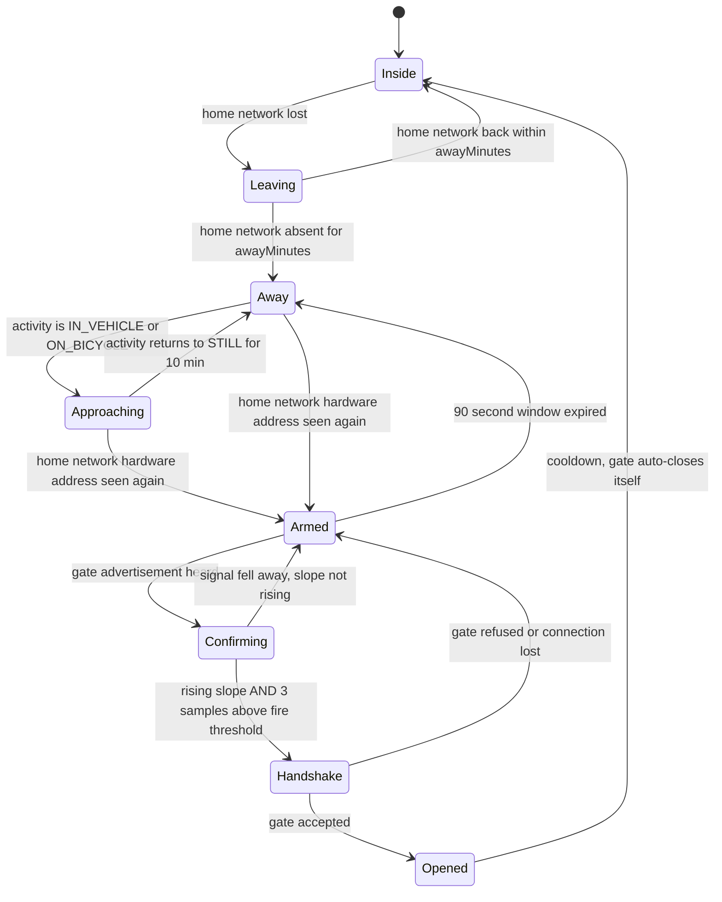

# V3 (future-plan): Automatic gate opening on approach

**Status: design only. Nothing here is built. No code in this document is meant to be pasted; it is
pseudocode to fix the contract between the two sides.**

Goal: the gate opens by itself as he rides or drives up to it, and does **not** open when he is
sitting in a room inside the house a few metres from the same gate, and does **not** open for
somebody else carrying a phone.

Constraint: 100 percent free. No billed Google Places, Maps, Geocoding or Roads calls. No paid
Blynk tier. Everything below runs on hardware he already owns plus free-forever platform services.

Two repositories are involved:

| Side | Repository | Role in this design |
|------|-----------|---------------------|
| Phone | this one (Spotwire) | Decides *whether* to open. Owns all the context. |
| Gate | `mhamidjamil/Door-Monitoring` (`esp32/working_dir/main_code.ino`) | Verifies *who* asked and vetoes. Owns the servo. |

---

## 1. What already exists (do not rebuild it)

### On the gate

Reading `esp32/working_dir/main_code.ino` (783 lines), the gate controller already has almost every
building block this feature needs:

- **A Bluetooth Low Energy peripheral is already running.** `initBLE()` at line 409 creates a GATT
  server named `ESP32 Servo` with service `1a8e61ca-82c3-4d8f-b635-2424a4c8cc72` and a
  read/write characteristic `67dbcc1b-8aa9-45b6-af99-fa06f9fd1a7c`, and starts advertising.
- **A line protocol on that characteristic.** Writes accumulate in `BLE_inputManager()` until a `#`
  arrives, then the assembled string goes to `inputManager()` (line 249) which already dispatches
  text commands. Adding one more command is a two-line change.
- **The actual open.** `doorState(true)` (line 691) drives the servo to `opening_angle`, records
  `door_last_open_on`, and `closeDoorIfNot()` auto-closes after `close_door_in` seconds.
- **A master kill switch.** `ALLOW_DOOR_OPENING`, persisted in SPIFFS, toggled by a long press of
  the physical button on GPIO 13, and honoured as the first check inside `doorState()`.
- **Runtime-tunable configuration.** `cspi.getFileVariableValue()` / `cspi.updateSPIFFS()` give a
  key/value store in flash, so new thresholds do not need a reflash to change.
- **Three command channels already wired.** Blynk (`BLYNK_WRITE(V1)` opens the gate), a local
  web server on port 80 with `/update` and `/getVariables`, and the Bluetooth characteristic.
- **A clock.** `NTPClient`, refreshed every 10 minutes, but only while the internet is reachable.

Two things about the current state are worth flagging before anything is added:

> 👀 The gate advertises the human-readable name `ESP32 Servo` together with the exact service
> identifier that accepts unlock commands, and that characteristic accepts a plaintext command from
> **any** unpaired device in range. Today, anyone standing outside the gate with a free Bluetooth
> scanner app can find it and write to it. Phase 1 below closes this whether or not the auto-open
> feature is ever built.

> 👀 The main loop is blocking: `manageBackGroundJobs()` ends in `delay(50)`, `alterDoorState()`
> holds `delay(1500)`, the `angle` command holds `delay(3000)`. Any design that asks the gate to run
> a continuous Bluetooth scan on this loop will produce garbage measurements. The recommendation
> below deliberately never asks it to scan.

### On the phone

`ArrivalService` already runs a foreground service, already sweeps Wi-Fi scan results, already knows
the home network's hardware address, and already writes structured records to Firestore. The gate
feature is a consumer of that machinery, not a second copy of it.

---

## 2. The hard problem, stated honestly

The gate controller is mounted **on the gate**. A room inside the house can be five to ten metres
from it, through one wall. A rider approaching on the street is ten to thirty metres from it, with
line of sight.

Signal strength cannot separate those two. Rough figures for an ESP32 advertising at its default
power:

| Situation | Typical received strength |
|-----------|--------------------------|
| Phone 1 metre from the gate, outside | about -50 dBm |
| Rider 15 metres out, line of sight down the street | about -80 to -85 dBm |
| Phone 8 metres away **inside**, through one brick wall | about -80 to -90 dBm |
| Rider 30 metres out, line of sight | about -90 dBm |

**The inside case and the approaching case overlap, and on a bad day they invert.** A phone in his
pocket while he sits on a sofa can read *stronger* than the same phone on the street. Any rule of the
form "open when strength is above X" will open the gate while he is watching television. This is the
single most important claim in this document, and it is why the design below spends most of its
effort on signals that are not distance.

It gets worse if the obvious fix is tried. Raising the gate's transmit power to reach further down
the street raises the indoor reading by exactly the same amount. One antenna sitting at the boundary
cannot be made to prefer outside over inside by turning the volume up.

So: **distance is the last check, never the first one.** What actually separates the two cases is
*history* and *motion*, both of which only the phone knows.

---

## 3. Comparing the candidate mechanisms

| Mechanism | Separates inside from outside? | Battery cost | Free? | Verdict |
|---|---|---|---|---|
| Bluetooth signal strength threshold alone | **No.** See section 2. | High if always scanning | Yes | Never sufficient on its own |
| Signal strength **slope** plus hysteresis | Partly. A rider produces a rising ramp over 5 to 15 seconds; a sofa produces flat noise. | High while sampling | Yes | Good final confirmation, useless as a trigger |
| Phone advertises, gate scans | No, and the gate has no context to add | Moderate on phone, heavy on gate | Yes | Rejected, see section 4 |
| Gate advertises, phone scans | No by itself, but the phone can combine it with everything else | Heavy, so it must be time-boxed | Yes | **Chosen**, as the final stage only |
| Home Wi-Fi hardware address visible | Weak as a level, **strong as a transition**. Continuously visible for hours means inside. Absent for 20 minutes then reappearing means a boundary crossing. | Near zero, already being scanned | Yes | Chosen as the *arming* trigger |
| Was-away state machine | **Yes, decisively.** You cannot arrive without having left. | Zero | Yes | Chosen as the hard precondition |
| Activity recognition (in-vehicle, on-bicycle, still) | **Yes.** Sitting in a room is `STILL` or `WALKING`, never `IN_VEHICLE` or `ON_BICYCLE`. | Near zero, the system reports transitions | Yes, Play Services, no billing | Chosen as the outer gate |
| Satellite positioning geofence | Yes, but slow to fix, poor in an urban street, and drains the battery | High | The Android geofencing API is free; the billed Places and Roads services are not needed | Optional Phase 4 only |
| Firestore command document | Not a proximity signal at all | Low | Yes, existing project | Chosen as the manual fallback |
| Blynk virtual pin | Not a proximity signal at all | Low | Device HTTP API is free; the Platform API is a paid tier, and the free plan caps devices and automations | Keep as an emergency fallback, do not build on it |
| Local network HTTP call to port 80 | Only works once already on home Wi-Fi, which is too late | Low | Yes | Useful fallback while inside |

The two rows that carry the design are the ones that cost nothing: **was-away** and **activity**.
Both are pure phone-side state. Neither needs a radio to be turned on for them.

---

## 4. Who advertises and who scans

### Option A: the gate advertises, the phone scans and decides

- The phone measures the signal. The phone already holds the Wi-Fi history, the away state, the
  activity state, the time of day, the per-place user settings and the user's own on/off switch.
- The gate does what it already does today. Advertising is cheap and, in the ESP32's radio
  scheduler, a high-priority advertising event can even preempt the Wi-Fi time slice. It costs the
  gate essentially nothing.
- Cost: the phone has to scan, and background Bluetooth scanning on Android is exactly the fragile
  thing that has been producing the missing-alert symptoms in the existing arrival feature.

### Option B: the phone advertises, the gate scans and decides

- The gate would need a continuous scan while also holding a Wi-Fi station connection. The ESP32 has
  **one** 2.4 GHz radio shared by both, time-division multiplexed; a scan window is routinely
  interrupted by Wi-Fi and the resulting signal samples are irregular. The gate is already running
  Wi-Fi, Blynk, a web server, JSON parsing, SPIFFS and NTP, and its Bluetooth stack is the
  memory-hungry Bluedroid one; adding a scanner risks running out of heap.
- The gate would be deciding with almost no information. It cannot see the phone's Wi-Fi
  association, cannot see the phone's motion, and cannot know "was away" without keeping its own
  long-lived history of a phone whose Bluetooth address rotates every fifteen minutes anyway.
- Android background advertising is *at least* as fragile as background scanning on Android 12 and
  later, and needs the same foreground service, so there is no reliability win.
- It is also the worst privacy posture: the phone would broadcast "I am here" to the whole street,
  continuously, everywhere it goes.

**Decision: Option A.** The decision belongs where the context is, and the context is on the phone.
The gate stays a cheap always-on advertiser plus an authenticator, and never runs a scanner.

The important twist: the gate must **not** simply obey an "open" message from the phone. If it did,
the whole security of the gate would be one replayable message. Instead the gate keeps a veto and
applies its own local rules. And it gets a distance check for free: **every established Bluetooth
connection has a link signal strength that the ESP32 can read directly**, so the gate can confirm the
requester is genuinely nearby without ever scanning.

---

## 5. Recommended architecture: the armed-window handshake

A funnel. Each tier is cheaper than the one below it, and a tier only turns on the tier below when it
passes. Nothing scans continuously.

```
Tier 0  ACTIVITY          free, always on, no radio
        Activity Transition API reports entering IN_VEHICLE / ON_BICYCLE / WALKING
        and exiting STILL. No transition, ever, means nothing below this line runs.
                     |
Tier 1  AWAY STATE        free, pure bookkeeping
        The phone must have been AWAY (home network unseen for >= awayMinutes)
        before an ARRIVING is even possible. Sitting on the sofa never leaves
        the INSIDE state, so it can never reach this tier.
                     |
Tier 2  ARM              near zero, reuses the Wi-Fi sweep that already runs
        Home network hardware address reappears in a scan after the away gap.
        On a bike this typically fires 20 to 40 metres out, well before
        Bluetooth range. This is the arming event, and it starts a 90 second
        window.
                     |
Tier 3  CONFIRM          expensive, and time-boxed to that 90 second window only
        Bluetooth scan for the gate's advertisement. Require a RISING signal
        slope across a sliding window AND a sustained close reading across
        3 consecutive samples. Hysteresis: arm at -85 dBm, fire at -65 dBm,
        disarm below -95 dBm for 30 seconds.
                     |
Tier 4  ACT
        Connect -> gate issues a fresh nonce -> phone returns an authentication
        code -> gate verifies key, counter, its own link signal strength,
        curfew, per-key policy and cooldown -> servo. Auto-close as today.
```

State machine on the phone:



The critical property: **`Inside` has no edge to `Armed`.** Sitting in a room cannot reach the
opening path at all, no matter how strong the Bluetooth signal is. That is not a threshold that can
be mistuned, it is a missing transition.

The same state machine is what the existing arrival alerts need. Reusing it is the point, not a
coincidence.

---

## 6. What a Bluetooth-only gate can and cannot verify about identity

This section exists so nobody later assumes more safety than is actually there.

### It can verify

- **That the peer holds the shared secret.** A challenge and response using a keyed hash is strong,
  and the ESP32 has hardware acceleration for the hashing, so it is effectively free.
- **That the message is fresh.** The gate issues the nonce, so a recorded exchange cannot be reused.
- **That the peer is currently connected to it.** Not spoofable without actually being in radio
  range, or relaying (see below).
- **Roughly how far the connected peer is**, from the link signal strength. Weak evidence, but it is
  free and it is a genuine second opinion on the phone's own claim.

### It cannot verify

- **Who is holding the phone.** Bluetooth identity means possession of a key on a device. A stolen,
  unlocked phone opens the gate. The only real mitigation is on the phone: keep the gate key in the
  Android Keystore with user authentication required, so the key is unusable while the phone is
  locked. That is a phone-side fix and it belongs in Phase 3.
- **The true distance.** A relay attack, two radios bridging the link over a long distance, defeats
  every signal-strength check that exists. The proper defence is ultra-wideband ranging, which this
  hardware does not have and which is not free. Practical mitigation is to keep the automatic window
  narrow, keep the automatic opening capped and logged, and keep the existing auto-close.
- **Whether a person is there at all.** A phone left in a taxi that drives past the gate satisfies
  every radio test. Only the activity and away-state context makes that unlikely, and that context is
  a claim by the phone, not a proof to the gate.
- **Anything the phone asserts.** "I was away", "I am on a bicycle", "I am approaching" are all
  claims. The gate believes them because it believes the key. State that plainly rather than
  pretending the gate independently verified them.
- **The phone by its address.** Android advertises and connects using a resolvable private address
  that rotates roughly every fifteen minutes. **Address allow-listing is useless.** Identity always
  lives in the payload.

### Bonding versus application-level authentication

Bluetooth bonding (LE Secure Connections) would give link encryption and, usefully, would let the
gate resolve the phone's rotating address and recognise a known phone *before* it connects. The cost
is that bonding on Android is operationally miserable for a background app: bonds get dropped,
re-pairing needs user interaction, and behaviour across manufacturers is inconsistent.

Recommendation: **application-level authentication over an unbonded link.** It does not depend on the
pairing stack, it survives a factory-reset gate followed by a re-provision, and it is testable from a
generic Bluetooth app during development. Revisit bonding only if pre-connection recognition turns
out to be needed.

### The exchange

```
phone -> gate   connect, subscribe to notifications
gate  -> phone  NONCE <8 random bytes> <counter>
phone -> gate   AUTO <keyId> <truncated keyed hash of (nonce, counter, "AUTO", keyId)>
gate            verify key exists, hash matches, counter > stored counter,
                link signal strength above floor, ALLOW_DOOR_OPENING is on,
                per-key policy permits automatic opening,
                not inside curfew, cooldown elapsed
gate            burn the nonce, persist the counter, doorState(true)
gate  -> phone  OK <reason code> or DENIED <reason code>
```

The counter must be persisted so that power-cycling the gate cannot rewind it, which is the whole
mechanism behind the rollback class of attacks on remote entry systems. To avoid wearing out the
flash, persist a high-water mark ahead of the current value and only rewrite when it is crossed.

Curfew needs a clock, and the gate's clock only syncs while the internet is up. **If the time is
unknown, curfew fails closed:** no automatic opening, manual button and physical button still work.

---

## 7. Failure modes, worked through

| Failure mode | What stops it | If that fails |
|---|---|---|
| **Phone in a room 10 m from the gate.** | Three independent gates, all of which must pass: the state machine is in `Inside` and has no path to `Armed`; the activity is `STILL`; nothing armed the scanner so no scan is even running. | Even if all three somehow passed, the rising-slope requirement fails on a stationary phone: a sofa produces flat noise, not a ramp. |
| **Two phones (his and his wife's, or a guest's).** | Each phone gets its own key with its own identifier. The gate holds a small key table in SPIFFS with per-key policy: automatic opening allowed or not, curfew hours, daily cap. A guest key has automatic opening disabled and can only ever use the manual button in the app. | Both arriving together fires twice: the gate's cooldown (one automatic opening per 60 seconds) makes the second a no-op. The log records which key opened it. |
| **Replayed Bluetooth packet.** | The opening is never a broadcast. It is a connected exchange with a gate-issued nonce and a monotonic counter, so a recording is worthless on replay. A pure advertisement-carried token, by contrast, is replayable by definition by anyone with a cheap sniffer. | The counter is persisted across power cycles, so a rollback replay also fails. |
| **Gate opens while nobody is actually home.** | Automatic opening requires a live authenticated connection *at that instant*, so nothing beyond Bluetooth range can trigger it, plus the away-state precondition, plus the cooldown, plus the curfew, plus `ALLOW_DOOR_OPENING`. | The existing auto-close means a bad opening self-heals in seconds. Every automatic opening writes a Firestore record and pushes a notification, so a spurious opening is visible rather than silent. |
| **Relay attack (two radios bridging the link).** | Not defeated. Stated openly. | Narrow window, cooldown, logging, notification, and the physical `ALLOW_DOOR_OPENING` switch he can flip by holding the gate button. |
| **Wi-Fi down at the gate, or internet down.** | The whole automatic path is local Bluetooth and does not touch the internet. It keeps working. | Only the remote manual "open" fallback stops working, which is correct behaviour. |
| **Phone's Bluetooth turned off, or Android killed the service.** | Nothing opens automatically. The physical button and the Blynk button still work exactly as today. | This is why automatic opening is an addition, never a replacement for the existing controls. |
| **Gate is out of radio range but the phone thinks it arrived.** | The phone cannot open anything it cannot connect to. The failure is silent and safe. | The app shows "gate not reachable" so he knows to use the button. |
| **Someone jams or floods the gate's Bluetooth.** | Not defeated; a denial-of-service on the radio is always possible. | Physical button. The gate must never depend on radio for a person standing at it. |

---

## 8. Battery, which was the other half of the complaint

The existing arrival service scans every two minutes, all day, forever. This design does not add a
second always-on loop; it adds a *conditional* one.

| Tier | When it runs | Cost |
|---|---|---|
| Activity transitions | Always | Effectively zero. The system reports transitions through a pending intent; the app is not polling anything. |
| Away-state bookkeeping | On each Wi-Fi sweep that already happens | Zero extra |
| Wi-Fi sweep | Should itself become adaptive: back off to 10 or 15 minutes while `STILL`, tighten to 30 to 60 seconds while `IN_VEHICLE` or `ON_BICYCLE`, and sweep immediately on an activity transition | **Net saving** against today's fixed two minutes |
| Bluetooth scan | Only inside a 90 second armed window, only after an away-to-arriving transition | A few minutes of scanning per day instead of continuous |

The motion awareness he asked for is therefore not a bolt-on: it is what pays for the Bluetooth
stage. A phone sitting still on a desk sweeps rarely and never scans.

---

## 9. Replacing the build-time constants with per-place settings

The current `WIFI_STABILITY_MINUTES` and `MIN_WIFI_STABILITY_MINUTES` are compile-time values from
`local.properties`. They become per-place fields on `Place`, editable in the app, stored in the user
document, and the gate-related ones are mirrored into the gate's SPIFFS configuration through the
existing `/update` route so they are tunable without a reflash.

| Setting | Lives on | Meaning |
|---|---|---|
| `awayMinutes` | Place | How long the network must be unseen before "away" is true |
| `stabilityMinutes` | Place | Existing arrival-alert confirmation wait, now per place |
| `armWindowSeconds` | Place | How long the Bluetooth stage stays open after arming |
| `fireRssi` / `armRssi` / `dropRssi` | Place | Hysteresis thresholds, calibrated on site |
| `sustainSamples` | Place | Consecutive close samples required |
| `autoOpenEnabled` | Place | The user's own on/off switch, off by default |
| `curfewStart` / `curfewEnd` | Place, mirrored to gate | No automatic opening in these hours |
| `cooldownSeconds` | Gate | Minimum gap between automatic openings |
| `linkRssiFloor` | Gate | The gate's own second-opinion distance check |
| per-key `autoOpenAllowed` | Gate | Guest keys get manual only |

Thresholds are unknowable in advance. They have to come from real measurements at his actual gate,
which is what the shadow mode in Phase 2 is for.

---

## 10. Phased rollout

### Phase 0: phone app only. Fix the detector first.

No gate work at all. Build the away/arrived state machine, the activity gating, the adaptive sweep
cadence, and the per-place settings, and use them to fix the existing arrival alerts.

This is a **hard prerequisite, not a nice-to-have.** Every one of the three reported symptoms is the
missing state machine:

- no alert on arriving is a detector that misses the transition,
- an alert firing hours late when Wi-Fi is switched back on in the morning is a detector with no
  concept of "was I away", it just sees a network appear,
- a 15 minute trip home and back producing neither alert is a once-per-day guard applied to a
  detector with no away/arrived notion at all.

A gate that opens on a detector with those three bugs would open in the morning when he turns Wi-Fi
back on, while he is asleep in bed. **Do not start Phase 1 before Phase 0 ships and is observed
working for a fortnight.**

### Phase 1: gate firmware only. Harden and prepare.

Independently testable with any generic Bluetooth app; needs no app changes.

- Move from Bluedroid to NimBLE to free the memory the rest of this needs.
- Stop advertising a self-describing name and the unlock service identifier in the clear.
- Add the key table in SPIFFS with per-key policy.
- Add the nonce and counter challenge, the keyed-hash verification, and the persisted counter with a
  high-water mark.
- Add a distinct automatic-open command, separate from the existing manual one, so policy can differ.
- Add the cooldown, the curfew (failing closed when the time is unknown), and the link signal
  strength floor.
- Log every opening with its source (physical button, Blynk, local network, Bluetooth automatic,
  Bluetooth manual) and which key.
- Make the blocking waits in the main loop non-blocking so the radio work is not starved.

### Phase 2: phone app. Build the client, but do not let it open anything.

- Bluetooth scanning client with the slope and hysteresis logic, running only inside the armed
  window, on a foreground service with the correct service type for connected devices.
- The handshake client.
- A manual "Open gate" button in the app, which also becomes the permanent fallback path.
- **Shadow mode:** the automatic path logs "would have opened, reason X, signal Y" and does not send
  the command. Run it for two to three weeks. Tune the thresholds from those logs, not from guesses.

### Phase 3: both sides. Turn it on.

- Enable automatic opening, off by default, per place, behind an explicit switch.
- Multi-key provisioning for his wife and for guests.
- Firestore command document as the remote fallback and the audit trail, reusing the existing job
  document pattern so the gate history lands next to the message history.
- Bind the gate key to the Android Keystore requiring device unlock, so a locked phone cannot open
  the gate.

### Phase 4: optional, only if the inside/outside separation still proves marginal in the logs.

- A second cheap ESP32 mounted **outside** the gate as an outside-only antenna, reporting to the main
  one over ESP-NOW. Hearing the outside node strongly and the inside node weakly is a genuine
  direction discriminator, which one antenna can never be.
- Or the free Android geofencing API as an extra outer gate, accepting the slower fix time.

### Ownership summary

| Phase | Phone app | Gate firmware |
|---|---|---|
| 0 | Everything | Nothing |
| 1 | Nothing | Everything |
| 2 | Everything | Nothing |
| 3 | Keystore binding, multi-key provisioning, Firestore channel | Key table population, Firestore or local-network fallback listener |
| 4 | Optional geofence | Optional outside node |

The phasing is deliberately arranged so that Phase 0 and Phase 1 can be built in parallel by two
people who never touch the same file, and each is independently useful even if the other is never
finished. Phase 1 alone fixes a real security hole in the gate that exists today.

---

## 11. Open questions

> ❓❓❓ Should Phase 0 ship as part of the current arrival-alert fix and be tagged as such, or wait
> and be tagged as the start of V3? It is the same code either way; the question is only how the
> release is labelled.

> ❓❓❓ Is automatic gate opening wanted for the car only, or for the bicycle too? A bicycle is often
> reported as `ON_BICYCLE` but sometimes as `WALKING`, so including bicycles means loosening the
> activity gate and leaning harder on the away-state and signal slope.

> 👀 The gate needs a per-key secret provisioned onto it. Easiest route is the existing local web
> server on port 80 while on home Wi-Fi, one time per phone. Confirm that is acceptable, or say if
> provisioning should go through the local Bluetooth link instead.

> 👀 What should the curfew hours be, and should the gate refuse automatic opening entirely at night
> or just require a stronger signal then?

---

## Sources consulted

- [ESP-IDF, RF Coexistence on ESP32](https://docs.espressif.com/projects/esp-idf/en/latest/esp32/api-guides/coexist.html)
- [Android developers, detect when users start or end an activity](https://developer.android.com/develop/sensors-and-location/location/transitions)
- [Android BLE scanning in the background, 2026](https://bleadvertiserapp.medium.com/android-ble-scanning-in-2026-why-your-app-stops-finding-devices-in-the-background-and-how-to-fix-ba5ae06c17c3)
- [Why Android BLE advertisements silently fail in the background on Android 12+](https://dev.to/ble_advertiser/why-your-android-ble-advertisements-silently-fail-in-the-background-on-android-12-and-how-to-fix-it-n0d)
- [Novel Bits, Bluetooth addresses and privacy](https://novelbits.io/bluetooth-address-privacy-ble/)
- [Rolling code, and the rollback replay class](https://en.wikipedia.org/wiki/Rolling_code)
- [RollBack: a time-agnostic replay attack against remote keyless entry](https://arxiv.org/pdf/2210.11923)
- [Blynk documentation, limits and plan differences](https://docs.blynk.io/en/blynk.console/limits)
- [mhamidjamil/Door-Monitoring](https://github.com/mhamidjamil/Door-Monitoring)
