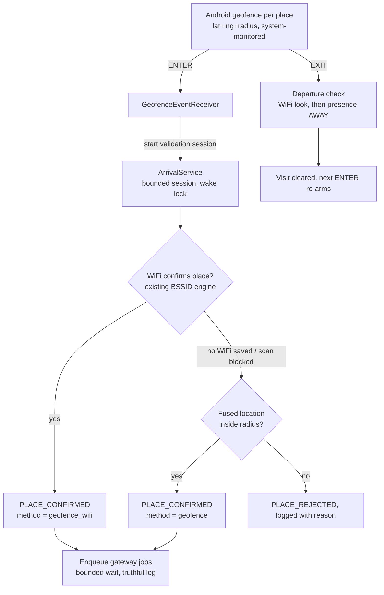

# V4: Geofence + WiFi hybrid detection

Written 2026-08-11, before any V4 code. Part one is the diagnosis of the failures
reported on build 1.5.0 (alerts that look queued but never reach Firebase, the
hostel place never alerting, arrival messages carrying the wrong time, a stale
status notification, and three screens disagreeing about the current place).
Part two is the redesign: Android geofencing becomes the low-battery trigger,
the existing WiFi engine becomes the confirmation layer, and nothing about the
gateway firmware or the `sms_jobs` contract changes.

---

## Part one: what is actually broken today

### 1.1 "The app queued it, but it is not on Firebase"

The arrival send writes a two-document batch (the gateway job plus the history
row) and then waits for the SERVER to acknowledge it
(`app/src/main/java/com/textgate/app/data/firebase/FirestoreDataSource.kt:376`).
Firestore applies the batch to the LOCAL cache instantly, so the Auto page shows
a "Pending" row immediately, from this phone's own cache. If the network is
poor or absent at that moment:

- The wait never returns. There is no timeout anywhere on the path.
- The wait sits inside the sweep loop
  (`app/src/main/java/com/textgate/app/services/ArrivalService.kt:220-225`),
  so ALL monitoring stops: no more checks, no departure detection, and the
  ongoing notification freezes on whatever it last said. This is one incident,
  not two: the frozen "No WiFi networks heard" notice and the missing sends
  have the same cause.
- The job lives only in the phone's offline mutation queue. It syncs whenever
  the process next runs with a network, which can be hours later, and the SMS
  then goes out hours late with the old time inside it.
- Nothing in the app can tell a cached write from a server-acknowledged one:
  `hasPendingWrites` / `waitForPendingWrites` appear nowhere in the source.
- The status poll then re-reads the SAME cache and re-confirms "pending"
  (`FirestoreDataSource.kt:535-538`), so the illusion confirms itself.

Two aggravators:

- `RecordArrivalUseCase` swallows every per-recipient enqueue failure and still
  returns success (`RecordArrivalUseCase.kt:110-124`), so the monitoring log
  prints a green "arrival alert sent" row even when zero jobs were created
  (`ArrivalService.kt:427-435`).
- While one send is parked waiting for the network, the motion trigger and the
  WiFi-join callback can start a second sweep (`ArrivalService.kt:134,169-171`);
  presence is still APPROACHING at that point, so the second sweep can send the
  whole fan-out again. The duplicate window opens exactly when the network is
  flaky.

### 1.2 Why the hostel never alerts while the office works

Four mechanisms stack up against a place you sleep at, and none of them apply
to a place you arrive at mid-day with the phone in use:

1. **Stale presence survives renames and revived ids.** Presence is stored per
   place id and never cleaned up (`PreferencesDataSource` keys
   `presence_<id>`, deleted only on sign-out). Renaming keeps the id; deleting
   every place resurrects the seeded `home`/`office` ids
   (`SettingsViewModel.kt:82`, `UserDto.kt:107-117`). A revived id inherits its
   old state. If that state is HERE, every sweep short-circuits with "already
   alerted for this visit" and writes NOTHING to the monitoring log
   (`ArrivalService.kt:376-379`). Leaving HERE needs an OBSERVED departure: two
   missed sweeps AND the surrounding networks changing by two thirds
   (`ArrivalService.kt:347-368`). Overnight, with the phone asleep, that
   departure is never observed, so the place stays HERE forever and never
   alerts again. This matches "I deleted it, renamed it to Hostel, still
   nothing" exactly.
2. **Blind adoption swallows night arrivals.** Any gap in observation (location
   off, three empty scans, service dead) parks presence BLIND; the first sweep
   that hears the place again adopts it as HERE deliberately WITHOUT an alert
   (`ArrivalService.kt:330-345`). Arriving at the hostel at night, after Doze
   has stalled the sweeps during the commute, lands in this branch. The rule is
   there for a good reason (a gap is not a transition), but WiFi alone has no
   way to know you actually travelled. A geofence ENTER is precisely that
   missing evidence.
3. **Doze stalls the clock.** The sweep cadence is a plain coroutine `delay`
   with no wake lock and the watchdog alarm is the non-wakeup kind
   (`ArrivalWatchdogReceiver.kt:75-80`), so with the screen off and the phone
   still, sweeps simply stop until something wakes the device. The dwell clock
   then never accumulates the required still-minutes.
4. **The service can run on a six-hour-old place list**
   (`ArrivalService.kt:233-242`), so edits made on the phone do not reach the
   running service until the next refresh, and a deleted place can even log a
   phantom "arrival alert sent" (`RecordArrivalUseCase.kt:31-32` returns
   success for a place that no longer exists).

### 1.3 The time inside the SMS

The message text stamps the clock at the moment the send DECISION is made
(`RecordArrivalUseCase.kt:63`), which is after the whole dwell wait (5 to 20
minutes) plus sweep granularity. The actual visit start,
`presence.visitStartedAt`, is recorded and then never read by anything
(`ArrivalService.kt:405`, `PlacePresence.kt`). If the write then sits in the
offline queue, the gateway later sends a message whose embedded time is the
decision time and whose delivery time is hours later. So "reached at 12:00,
SMS says 12:20 or 12:30" is exactly what the code does today.

### 1.4 The stale notification

Beyond the frozen-loop case in 1.1: the text bakes in the literal words
"checked just now" with no clock time (`ArrivalService.kt:450-453`), two early
returns skip the update entirely (`ArrivalService.kt:245-246`), the empty-scan
text never escalates even after presence has been parked blind, and a failed
notification post is swallowed silently (`ArrivalService.kt:507-510`).

### 1.5 Three screens, three answers

- The Arrival tab's health card reads its data ONCE per process
  (`SettingsViewModel.kt:58-61`), and a startup race can wipe it to "Nothing
  checked yet" plus "away" for good (`SettingsViewModel.kt:77-83` replaces the
  whole state instead of copying).
- "Where am I?" uses a third, much looser matching rule: any single saved
  network, no signal floor, no tie-break (`WifiUtils.kt:71-72`). It happily
  says "You are at Office" in conditions the real engine rejects.
- The monitoring log re-reads the same persisted state every 10 seconds, so it
  is usually right while the card beside it is stale. Same facts, different
  ages, different rules: guaranteed disagreement.

### 1.6 Why it degrades "after a few days"

Each of the failures above latches: a parked send stalls monitoring until the
process dies; a stuck HERE never re-arms; a wiped health card stays wiped until
the process restarts. The longer the app runs untouched, the more of them have
fired. Nothing here is random decay; they are latches with no release.

---

## Part two: the redesign

### 2.1 Stack decision: stay on native Kotlin

Geofencing, fused location, foreground services and WiFi scanning are all
native Android APIs; Flutter or any other cross-platform layer would wrap the
same APIs through a bridge, add its own background-execution quirks, and force
a full rewrite of a working app. Every failure found above is a logic defect,
not a platform defect. Changing stack is the one move guaranteed to make this
LESS reliable. Decision: no stack change.

### 2.2 Architecture

- **Geofence is the trigger.** Android watches the fences; between events the
  app runs nothing at all for geofenced places. ENTER and EXIT are handled; no
  DWELL (the WiFi dwell logic already de-bounces drive-pasts, and the fence is
  registered with no initial trigger so re-registering inside a fence cannot
  fire a false ENTER, which was the documented reason geofencing was rejected
  in V2).
- **WiFi is the confirmation.** On ENTER the service starts a bounded
  validation session (existing presence machine, fast cadence, a partial wake
  lock so Doze cannot stall the dwell clock, hard cap ~30 minutes) and confirms
  the place through the saved BSSIDs exactly as today. WiFi unavailable,
  throttled, or the place has no saved networks: fall back to one fused
  location fix; inside the radius confirms with method `geofence`, outside
  rejects. Every decision is logged with its reason.
- **A geofence ENTER is an observed transition.** Unlike a WiFi network
  reappearing after a blind gap, an ENTER can only fire on a genuine
  outside-to-inside crossing. So an ENTER while the stored state is HERE means
  the EXIT was missed: the visit is cleared and the new one may alert. This is
  the structural fix for the swallowed hostel alerts.
- **Legacy mode stays.** A place without coordinates, a denied background
  location permission, or missing Play services falls back to exactly today's
  always-on WiFi sweeps. The WiFi engine is not removed anywhere.

### 2.3 Place creation and radius

- The place editor gains coordinates and a radius. "Use my current location"
  fills them from fused location (the fix, its accuracy and the coordinates are
  shown on screen and logged); they can also be typed or pasted, which finally
  allows creating a place before first visiting it.
- Radius: default **150 m**, choices 100 / 150 / 200 / 300 / 500 plus a custom
  value clamped to 100..500 m (raised from the originally planned 50 m floor at
  Hamid's request, and because Android does not promise a fence tighter than
  about 100 m). Shown as "Detection radius: N meters". 500 m is the cap: the
  largest listed target (1 to 2 kanal) fits comfortably inside 200 m.
- Stored on the same `places` array in the user document (`latitude`,
  `longitude`, `radius_m`). The user-document rules have no field allowlist,
  so **no rules deploy is needed** and older builds ignore the new keys.

### 2.4 The send path tells the truth

- Every Firestore write on the arrival path gets a bounded wait. A commit that
  does not reach the server in time is reported as **"queued on this phone,
  waiting for network"**, never as sent; the sweep loop is never parked.
- Presence flips to HERE and the re-arm stamp is written BEFORE the network
  work starts, closing the duplicate-send window; a single-flight guard stops
  overlapping sweeps.
- The use case reports per-recipient outcomes; the monitoring log distinguishes
  sent / partly sent / failed / queued-waiting-network.
- The Auto page reads the pending-writes flag and shows "waiting for network"
  instead of a false "Pending", and surfaces the stored error text that today
  is written but never read (`AutoHistoryEntryDto` gains the `error` field).
- On service start and app open, the app flushes the offline queue
  (`waitForPendingWrites`) and logs when queued alerts actually reach the
  server.
- `sms_jobs` documents are byte-for-byte unchanged: same five fields, no
  `kind`, no new keys. The firmware and the deployed rules are untouched.
  Detection metadata (`detection_method`, `wifi_match`, `latitude`,
  `longitude`, `radius_m`, `detected_at`) goes on the owner-only
  `auto_history` rows only.

### 2.5 Timestamps

The SMS carries the **visit start**: the geofence ENTER time in hybrid mode,
or the first sweep of the visit (`visitStartedAt`) in legacy mode. The dwell
wait, the queue and the gateway can no longer move the time the recipient
sees. `detected_at` on the history row records the same instant for auditing.

### 2.6 Status surfaces agree

- One presence rule. The service's matcher (signal floor, required match
  count, loudest-wins-by-8dB) becomes a shared function used by the sweep,
  "Where am I?" and "Test detection here". The buttons also wait for a fresh
  scan the way the service does.
- The health card refreshes while visible and survives the startup race
  (health fields are merged, not overwritten).
- The notification always carries a clock time ("At Office, checked 2:41 PM"),
  updates on every path including the early returns, and escalates when
  parked blind. In hybrid mode there is no persistent notification at all
  between events, because nothing is running.
- The three silent diagnostic branches (already-alerted short-circuit, the
  two-places tie, surroundings-unchanged) now write monitoring log rows, and
  check rows include per-place signal detail ("hostel: 1 of 2 networks heard
  at -84 dBm, floor -80").

### 2.7 Place edits reach the engine

Saving places clears the stored presence and environment for any place whose
id disappeared or whose networks / coordinates changed, tells the running
service to reload its cached user immediately, and re-registers geofences.
The six-hour stale window is gone.

### 2.8 Logging and export

- The on-device log keeps structured entries (kind, place, message, detail)
  covering: place created/edited, geofence registered / register-failed /
  ENTER / EXIT, location request and fix (with accuracy and source), scan
  requested / empty / blocked, every match decision with signal levels, every
  confirm/reject with its reason, every enqueue outcome, sync recovery.
- Retention rises to **72 hours** (a failure noticed "2 or 3 days later" must
  still be inside the window), and the prune actually runs (the current
  append-counter resets on process death, so the file can grow without bound).
- **Export Logs** button on the Monitoring Log page: writes a plain-text and a
  JSONL copy to the cache directory and opens the standard Android share
  sheet (FileProvider), so the file can be saved or sent from the phone.

### 2.9 Permissions and the Play consequence

Required flow (staged, each step explained on screen, nothing at startup):

1. Precise location while in use (existing prominent-disclosure dialog).
2. **Background location** ("Allow all the time"), requested only when the
   user enables geofenced monitoring; on Android 11+ this is a Settings
   round-trip, and denial drops that place to legacy WiFi mode with a clear
   status line instead of a silent failure.
3. Notifications (Android 13+), battery-optimisation exemption (existing card).
4. Permanently-denied grants get a working "open app settings" button, which
   today's copy promises but does not provide.

**The recorded decision this reverses:** commit `80058c6` deliberately removed
`ACCESS_BACKGROUND_LOCATION` so the Play listing needs no background-location
declaration form and review video (`AndroidManifest.xml:20-24`,
`docs/PLAY-RELEASE.md:33`). Geofencing that fires with the app closed cannot
exist without that permission, so V4 puts it back, and the next Play
submission will require the declaration form, the demo video, and prominent
disclosure. This is a release-time cost, not a build-time one; it is flagged
in the release checklist and needs a go/no-go before the next store upload.

### 2.10 Battery expectations

Today: a permanent foreground service scanning every 2 to 15 minutes around
the clock. After V4, for geofenced places: no resident service, no polling;
the OS fence watcher (shared, already running for every app on the phone),
plus a few minutes of bounded scanning per actual arrival or departure. The
wake lock exists only inside those sessions. Legacy-mode places keep today's
cost, which is the incentive to add coordinates to every place.

### 2.11 What is deliberately NOT changing

- The firmware, its polling, its statuses, and the `sms_jobs` schema.
- The deployed Firestore rules (no deploy needed for V4).
- The presence machine's core rules (one alert per visit, observed departure,
  quiet hours, per-place sensitivity and closeness, the 8 dB contest).
- WhatsApp-first delivery and the per-recipient retry model.
- The WiFi capture flow for saving a place's networks.

### 2.12 Test scenarios (from the request, mapped)

| Scenario | Expected behaviour |
|---|---|
| A: walk into Office (50 m) | GEOFENCE_ENTER -> validation session -> WiFi match -> job created once, message time = ENTER time |
| B: stay hours | no polling between events, no second job (HERE latched, session over) |
| C: leave | GEOFENCE_EXIT -> departure check -> state cleared |
| D: return later | new ENTER -> new visit -> new job |
| E: WiFi unavailable | location fallback confirms or rejects with a logged reason; never a permanent stall |
| F: reboot | boot receiver re-registers every fence and restarts legacy monitoring if needed |
| G: app killed / closed | fences fire anyway (manifest receiver, geofence events may start the service from background) |
| H: move between rooms | inside the fence nothing changes; WiFi flicker cannot end a visit without the EXIT + departure check |

### 2.13 Implementation order (one commit each)

1. Truthful send path: bounded waits, honest logging, pending-write
   visibility, single-flight sweeps, offline-queue flush. (#16 #21)
2. Arrival messages carry the visit start time.
3. Notification truth: clock times, escalation, no silent early returns,
   precise-location start check. (#26 #27)
4. One shared presence rule for the service and both check buttons. (#26)
5. Live health card on the Arrival tab, race fixed. (#26)
6. Presence cleanup on place edits + immediate service reload + the missing
   log rows. (#16)
7. Structured log detail, 72 h retention, export via share sheet. (#28)
8. Place coordinates + radius editor + fused location capture.
9. Geofence registration, ENTER/EXIT receiver, validation sessions, hybrid
   decisions, boot re-registration.
10. Mode switching: no resident service when every place is geofenced;
    background-location permission flow; battery UX.
11. Documentation refresh (this file, AGENTS.md, stale schema notes).
12. Build bump to 1.6.0.
